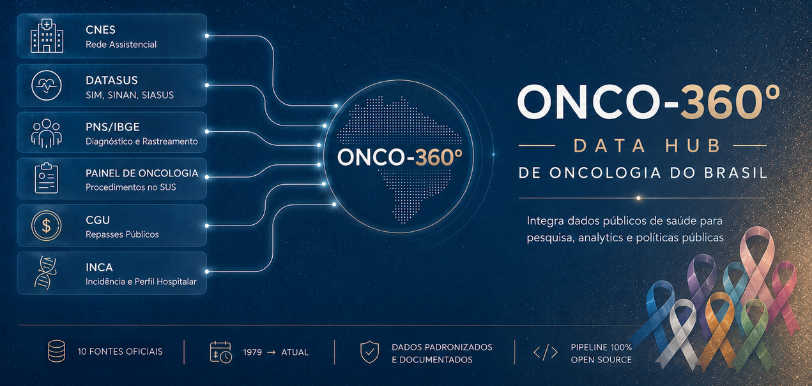

[](LICENSE)
[](https://www.kaggle.com/datasets/rafatrindade/onco-360)
[](https://github.com/rafa-trindade/onco-360-foundation)

**Onco-360** nasceu da necessidade de reunir, num único lugar e num formato pronto para análise, os dados públicos brasileiros sobre câncer que hoje estão espalhados entre sistemas diferentes do Ministério da Saúde, do IBGE, do INCA e da Controladoria-Geral da União - cada um com seu próprio formato, sua própria periodicidade e sua própria forma de acesso.

Idealizado e mantido por **[Rafael Trindade](https://www.linkedin.com/in/rafatrindade/)**, o projeto reúne mortalidade por câncer, rede assistencial habilitada em oncologia (com sinalizador adulto/pediátrico, endereço, geolocalização e leitos reais), procedimentos realizados no SUS, diagnóstico e rastreamento autorreferidos pela população, repasses públicos federais por instituição, e o perfil de incidência e atendimento hospitalar consolidado pelo INCA - cuidadosamente curados, padronizados e documentados, prontos para que pesquisadores, cientistas de dados e profissionais de saúde possam conduzir seus próprios estudos de forma organizada e reproduzível.

O dataset final está disponível no [Kaggle](https://www.kaggle.com/datasets/rafatrindade/onco-360), com um [notebook de exemplo](https://www.kaggle.com/code/rafatrindade/integra-o-e-vincula-o-de-dados-python) demonstrando como cruzar as bases (rede assistencial, repasses e mortalidade, por UF). Cobre diferentes dimensões do cuidado oncológico no Brasil: desde onde a rede está habilitada a atender e quanto de recurso público ela recebeu, até quem morre, quem é diagnosticado, quem se previne, e como diferentes fontes descrevem o mesmo problema sob ângulos distintos.

O objetivo de longo prazo é consolidar estudos derivados deste hub em **[github.com/rafa-trindade/oncoped-360](https://github.com/rafa-trindade/oncoped-360)** - um repositório de pesquisa e análise dedicado especificamente ao **câncer infanto-juvenil**, ainda em estruturação, que vai se apoiar nos recortes pediátricos já sinalizados nas bases deste hub (habilitações pediátricas do CNES, faixas etárias da PNS, incidência infanto-juvenil do INCA) para produzir um painel público e interativo sobre o tema.



## 📊 Fontes de Dados e Escopo

### **1. Rede Assistencial Habilitada em Oncologia (Fonte: CNES - DATASUS)**

O **Cadastro Nacional de Estabelecimentos de Saúde (CNES)**, mantido pelo **DATASUS/Ministério da Saúde**, é o registro oficial de todos os estabelecimentos de saúde do Brasil, incluindo suas habilitações específicas e a contagem real de leitos.

**Escopo e Processamento:** São combinados três arquivos do CNES via FTP/HTTP público do DATASUS: o **cadastro geral de estabelecimentos** (identificação, endereço, CNPJ - usado só como insumo interno, não publicado sozinho), os arquivos de **Habilitações** e os de **Leitos** (ambos organizados por UF e competência - usa-se sempre a competência mais recente disponível, retrato atual da rede). As habilitações são filtradas para manter apenas as de **Alta Complexidade em Oncologia** (códigos `17.04` a `17.16`, conforme Portaria SAES/MS nº 688/2023). O resultado final é **uma linha por instituição** (não por habilitação - uma mesma instituição pode ter mais de uma, ex: UNACON adulto + UNACON pediátrica), com sinalizador `PEDIATRICO` (True/False), lista completa de habilitações, contagem real de leitos, endereço completo, geolocalização, telefone e classificação administrativa/jurídica.

**Base disponibilizada:**

- `raw_cnes_oncologia_instituicoes.parquet` - Estabelecimentos com habilitação em oncologia: identificação, CNPJ (próprio e da mantenedora), endereço, lat/long, telefone, sinalizador adulto/pediátrico, habilitações, leitos reais, classificação administrativa e capacidades assistenciais.

> BRASIL. Ministério da Saúde. DATASUS. *Cadastro Nacional de Estabelecimentos de Saúde (CNES)*. Brasília, DF: Ministério da Saúde. Disponível em: <https://cnes.datasus.gov.br/>.

---

### **2. Mortalidade por Câncer (Fonte: SIM - DATASUS)**

O **Sistema de Informações sobre Mortalidade (SIM)** consolida as Declarações de Óbito de todo o país desde 1979 e é a base oficial para estatísticas de mortalidade no Brasil.

**Escopo e Processamento:** São baixados via FTP público do DATASUS os arquivos de Declaração de Óbito (`.dbc`) das três eras disponíveis - **CID-9 (1979-1995)**, **CID-10 consolidado (1996-atual)** e **CID-10 preliminar** (dados do ano corrente ainda não fechados) - convertidos para Parquet e filtrados **direto no processamento**, sem materializar a base geral de mortalidade (todas as causas), já que só o recorte de câncer interessa a este projeto. São mantidos os óbitos com causa básica (`CAUSABAS`) de **neoplasia maligna**, confirmada linha a linha contra as tabelas oficiais do DATASUS (capítulo II - Neoplasias): `140`-`208` no CID-9, `C00`-`C97` no CID-10. Faixas adjacentes (carcinoma in situ, neoplasias benignas, comportamento incerto) são deliberadamente excluídas por não serem "câncer" no sentido clínico/epidemiológico padrão - mesma definição usada por INCA e OMS/IARC. Cada arquivo traz também `CO_IBGE_RESIDENCIA`, o código de município já normalizado para 6 dígitos (o SIM usa o código IBGE completo, com dígito verificador; as demais bases deste projeto usam o reduzido) - pronto para cruzar com `raw_macroregiao_de_saude.parquet` ou `raw_cnes_oncologia_instituicoes.parquet` sem tratamento adicional.

**Bases disponibilizadas:**

- `raw_sim_obitos_cancer_cid9.parquet` - Óbitos por câncer, 1979-1995.
- `raw_sim_obitos_cancer_cid10.parquet` - Óbitos por câncer, 1996-atual.
- `raw_sim_obitos_cancer_prelim.parquet` - Óbitos por câncer do ano corrente, ainda não consolidados.
- `raw_sim_obitos_cancer_resumo_anual.csv` - Resumo ano a ano (total de óbitos, total de câncer, proporção), unificado entre as três eras.

*Observação: o arquivo preliminar pode legitimamente conter 0 registros entre ciclos de publicação do DATASUS - não é um erro de processamento.*

> BRASIL. Ministério da Saúde. DATASUS. *Sistema de Informações sobre Mortalidade (SIM)*. Brasília, DF: Ministério da Saúde. Disponível em: <https://datasus.saude.gov.br/mortalidade-desde-1996-pela-cid-10>.

---

### **3. Procedimentos Oncológicos no SUS (Fonte: Painel de Oncologia - DATASUS)**

O **Painel de Oncologia**, disponibilizado pelo DATASUS desde 2013, registra os procedimentos de diagnóstico e tratamento oncológico realizados no âmbito do SUS.

**Escopo e Processamento:** Sincronização via FTP público do DATASUS, com conversão dos arquivos `.dbc` para Parquet em lotes.

**Base disponibilizada:**

- `raw_painel_de_oncologia.parquet` - Procedimentos oncológicos realizados no SUS, desde 2013.

> BRASIL. Ministério da Saúde. DATASUS. *Painel de Oncologia*. Brasília, DF: Ministério da Saúde. Disponível em: <https://www.gov.br/inca/pt-br/assuntos/gestor-e-profissional-de-saude/painel-oncologia>.

---

### **4. Diagnóstico e Rastreamento Declarados (Fonte: PNS - IBGE)**

A **Pesquisa Nacional de Saúde (PNS)** é um inquérito domiciliar do **IBGE**, realizado em parceria com o Ministério da Saúde, que inclui um módulo dedicado a diagnóstico de câncer e rastreamento de câncer de colo do útero.

**Escopo e Processamento:** Foram utilizados os microdados de posição fixa das duas edições disponíveis (**2013 e 2019**). As posições de cada variável foram conferidas campo a campo contra os dicionários oficiais de cada edição antes de escrever os scripts de extração - as duas edições têm layouts diferentes o suficiente para não serem diretamente comparáveis (2013 registra o tipo de câncer como uma única variável categórica; 2019 usa 16 flags binárias independentes, permitindo mais de um tipo por pessoa, mas removeu a variável de idade no diagnóstico que existia em 2013). São produzidos dois recortes por edição: quem relatou diagnóstico de câncer, e o comportamento de rastreamento de câncer de colo do útero de todas as mulheres entrevistadas (independente de diagnóstico prévio).

**Bases disponibilizadas:**

- `raw_pns_2013_diagnostico_cancer.parquet` / `raw_pns_2019_diagnostico_cancer.parquet` - Diagnóstico, tipo de câncer, e (só em 2013) idade no diagnóstico e limitação nas atividades.
- `raw_pns_2013_rastreamento_colo_utero.parquet` / `raw_pns_2019_rastreamento_colo_utero.parquet` - Comportamento de rastreamento preventivo (Papanicolau): última vez que fez, motivo de não ter feito (só 2019), se foi pelo SUS, tempo até o resultado e encaminhamento após resultado (só 2019).

*Observação: por serem arquivos volumosos e sujeitos aos termos de uso de download do IBGE, os microdados brutos são obtidos manualmente, não via automação.*

> INSTITUTO BRASILEIRO DE GEOGRAFIA E ESTATÍSTICA (IBGE). *Pesquisa Nacional de Saúde (PNS)*. Rio de Janeiro: IBGE. Disponível em: <https://www.ibge.gov.br/estatisticas/sociais/saude/9160-pesquisa-nacional-de-saude.html>.

---

### **5. Incidência e Perfil Hospitalar (Fonte: INCA)**

O **Instituto Nacional de Câncer (INCA)** mantém dois sistemas de referência nacional: o **Registro de Câncer de Base Populacional (RCBP)**, com estimativas de incidência por população, e o **Registro Hospitalar de Câncer (RHC)**, com o perfil de atendimento hospitalar por unidade.

**Escopo e Processamento:** Bases **estáticas**, trazidas manualmente a partir de um snapshot já publicado. O INCA descontinuou o download integral do RCBP (o arquivo consolidado ficou grande demais; hoje a base só é disponibilizada por solicitação, um registro e uma janela de 4 anos por vez) e o download do RHC é gerado dinamicamente via formulário com sessão (sem URL fixa automatizável) - nenhum dos dois se presta a um pipeline de sincronização automática nos moldes das demais fontes deste projeto.

**Bases disponibilizadas:**

- `raw_inca_cancer_populacional.parquet` - Estimativas de incidência de câncer por população (RCBP).
- `raw_inca_registro_hospitalar.parquet` - Perfil de atendimento hospitalar de pacientes com câncer (RHC).

> BRASIL. Ministério da Saúde. Instituto Nacional de Câncer (INCA). *Registro de Câncer de Base Populacional* e *Registro Hospitalar de Câncer*. Rio de Janeiro: INCA. Disponível em: <https://www.inca.gov.br/>.

---

### **6. Repasses Públicos por Instituição Oncológica (Fonte: Portal da Transparência)**

O **Portal da Transparência do Governo Federal** disponibiliza, via mecanismo público de **Dados Abertos** (sem chave de API, sem login), o histórico completo de convênios federais - incluindo o CNPJ do beneficiário, o que permite cruzar diretamente com o CNES.

**Escopo e Processamento:** São baixados os convênios acumulados **desde 1996** (o arquivo é sempre o histórico completo até a data de referência, não um recorte por período - a fonte é atualizada semanalmente, e o pipeline detecta e baixa sempre a atualização mais recente). São mantidos apenas os convênios cujo objeto menciona câncer/oncologia (filtro por palavra-chave), cruzados por CNPJ com `raw_cnes_oncologia_instituicoes.parquet` - com **fallback para o CNPJ da entidade mantenedora** quando a unidade não tem CNPJ próprio (comum em hospitais universitários e redes, ex: EBSERH), sinalizado explicitamente em `CNES_VIA_CNPJ_MANTENEDORA`.

**Base disponibilizada:**

- `raw_convenios_cancer.parquet` - Convênios federais com objeto relacionado a câncer/oncologia, já cruzados com a instituição beneficiária (nome, endereço, geolocalização, sinalizador adulto/pediátrico).

> BRASIL. Controladoria-Geral da União (CGU). *Portal da Transparência*. Brasília, DF: CGU. Disponível em: <https://portaldatransparencia.gov.br/>.

---

### **7. Base Auxiliar (Macrorregião de Saúde)**

Para permitir cruzamentos geográficos entre as demais bases, o projeto conta com uma base auxiliar de referência, construída a partir de **dados abertos do Ministério da Saúde**.

**Escopo e Processamento:** o arquivo de municípios (Dados Abertos da Saúde) é combinado, via join no código do município, com um arquivo complementar de geolocalização.

**Base disponibilizada:**

- `raw_macroregiao_de_saude.parquet` - Municípios brasileiros associados às suas macrorregiões de saúde, regiões de saúde, UF e coordenadas geográficas.

---

## 🗓️ Cobertura Histórica

O repositório combina diferentes janelas temporais, de acordo com a fonte:

- **SIM/DATASUS (mortalidade):** série histórica desde 1979 (CID-9) até o ano corrente (CID-10 preliminar), com atualização contínua.
- **Painel de Oncologia:** desde 2013, com atualização contínua.
- **CNES (Estabelecimentos/Habilitações/Leitos):** retrato do mês mais recente disponível (não histórico).
- **Portal da Transparência (Convênios):** acumulado desde 1996, atualizado semanalmente - é a fonte com a cadência de atualização mais frequente do projeto.
- **PNS/IBGE:** edições pontuais de 2013 e 2019 (periodicidade do próprio inquérito).
- **INCA (RCBP/RHC):** snapshots estáticos, na cobertura temporal da última extração disponível antes da descontinuação do download integral.

---

## 🔄 Atualização e Confiabilidade

Nem todas as fontes têm a mesma dinâmica de atualização:

- **SIM, Painel de Oncologia, CNES (Estabelecimentos/Habilitações/Leitos), Portal da Transparência:** sincronização totalmente automatizada (FTP ou Dados Abertos), com detecção de novidade real (por tamanho/hash de conteúdo) antes de reprocessar ou publicar - nenhuma dessas fontes reprocessa ou republica à toa quando nada mudou na origem.
- **PNS/IBGE:** bases estáticas por edição - cada edição é um retrato fechado no tempo, incorporada quando o IBGE publica os microdados oficiais. O processamento é automatizado; a obtenção do microdado bruto é manual.
- **INCA (RCBP/RHC):** bases estáticas, sem pipeline de atualização (ver Fontes de Dados acima para o motivo).

O pipeline só publica uma nova versão (bucket + Kaggle) quando pelo menos uma fonte automatizada reporta dado novo de verdade - evita gerar versões vazias no Kaggle e preserva tags/metadados configurados manualmente entre publicações.

---

## 📁 Estrutura de Pastas do Dataset

```
raw_cnes_oncologia_instituicoes.parquet
raw_convenios_cancer.parquet
raw_inca_cancer_populacional.parquet
raw_inca_registro_hospitalar.parquet
raw_macroregiao_de_saude.parquet
raw_onco360_metadados.csv
raw_painel_de_oncologia.parquet
raw_pns_2013_diagnostico_cancer.parquet
raw_pns_2013_rastreamento_colo_utero.parquet
raw_pns_2019_diagnostico_cancer.parquet
raw_pns_2019_rastreamento_colo_utero.parquet
raw_sim_obitos_cancer_cid9.parquet
raw_sim_obitos_cancer_cid10.parquet
raw_sim_obitos_cancer_prelim.parquet
raw_sim_obitos_cancer_resumo_anual.csv
```

Todos os arquivos ficam na raiz do dataset (sem subpastas) - `raw_onco360_metadados.csv` traz, pra cada um, a fonte, descrição, tipo de atualização e contagem de registros.

---

## 📄 Licença e Créditos

Este dataset consolidado é disponibilizado sob licença **CC0 1.0** (domínio público). Isso se refere ao trabalho de curadoria, padronização e harmonização realizado neste repositório - os dados originais permanecem de titularidade e responsabilidade das instituições abaixo, que devem ser citadas ao utilizar cada fonte individualmente:

- **DATASUS (CNES, SIM, Painel de Oncologia):**
  > BRASIL. Ministério da Saúde. DATASUS. Brasília, DF: Ministério da Saúde. Disponível em: <https://datasus.saude.gov.br/>.

- **IBGE (Pesquisa Nacional de Saúde):**
  > INSTITUTO BRASILEIRO DE GEOGRAFIA E ESTATÍSTICA (IBGE). *Pesquisa Nacional de Saúde (PNS)*. Rio de Janeiro: IBGE. Disponível em: <https://www.ibge.gov.br/estatisticas/sociais/saude/9160-pesquisa-nacional-de-saude.html>.

- **INCA (RCBP e RHC):**
  > BRASIL. Ministério da Saúde. Instituto Nacional de Câncer (INCA). Rio de Janeiro: INCA. Disponível em: <https://www.inca.gov.br/>.

- **Portal da Transparência (Convênios):**
  > BRASIL. Controladoria-Geral da União (CGU). *Portal da Transparência*. Brasília, DF: CGU. Disponível em: <https://portaldatransparencia.gov.br/>.

Se você utilizar este dataset em pesquisas, reportagens ou análises, considere citar tanto a fonte original relevante (acima) quanto este repositório de curadoria.

---

#### **Idealização e manutenção:**
- [Rafael Trindade](https://www.linkedin.com/in/rafatrindade/)